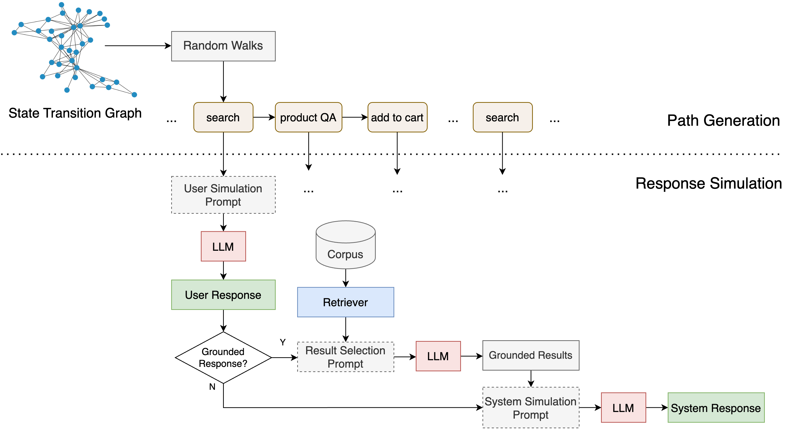

# SynTOD
SynTOD is a new synthetic data generation approach for developing end-to-end Task-Oriented Dialogue Systems (TODS) capable of handling complex tasks such as intent classification, slot filling, conversational question-answering, and retrieval-augmented response generation, without relying on crowdsourcing or real-world data. SynTOD utilizes a state transition graph to define the desired behavior of a TOD system and generates diverse, structured conversations through random walks and response simulation using large language models (LLMs). Based on our experiments, SynTOD leads up to 37% improvement in intent classification, 100% in slot filling and 30% in response relevance compared to naive single-prompt simulated conversations. By incorporating retrieval augmentation, SynTOD enables the development of TOD systems that can handle complex dialogues that involve navigation, search, result filtering, summarization, and question answering. Our datasets, models and code are released here to serve as proxy benchmarks for building TOD systems. More details in our paper [here](https://arxiv.org/abs/2404.14772)



## Set up the environment

```
conda create -n syntod python=3.10
conda activate syntod
```

## Framework Structure

This framework includes the following steps:

1. Seed data (corpus items with metadata) is used to generate initial conversational data in jsonl format using random intent paths and multiple simulation prompts with LLMs
2. Initial data undergoes preprocessing to create data in simple text format for LLM fine-tuning with QLoRA (in OpenAssistant format)
3. After fine-tuning we can run inference, and evaluation scripts for intent classification, slot filling and response relevance

For reference, this repository has the following structure :

```
.
└── SynTOD/
    ├── data/
    │   ├── recipe/
    │   │   ├── seed/
    │   │   ├── initial/
    │   │   ├── oasst/
    │   │   └── inference/
    │   ├── ecommerce/
    │   │   ├── seed/
    │   │   ├── initial/
    │   │   ├── oasst/
    │   │   └── inference/
    │   └── README.md
    ├── src/
    │   ├── data-generation/
    │   ├── oasst-preprocess/
    │   ├── fine-tuning/
    │   ├── inference/
    │   └── evaluation/
    ├── reports/
    │   ├── figures/
    │   └── documentation.md
    └── README.md
```

## Run the framework

1. **Data generation**

    This part proides code for generating synthetic conversations. We have provided a framework on how to generate conversations using a transition graph in two domains. 
Because of the nature of random walks and non-zero temperaure used in prompting LLMs, the output might differ in multiple runs. More details [here](src/data-generation/README.md)

2. **Preprocessing**

   From the data generation process, we will have the data in the following folder:

   ```
   data/[domain]/initial/
   ```

   More detail regarding the format and the preprocessing, see [here](src/evaluation/README.md)

   To run the preprocessing run the following command : [Add more soon]

   ```
   python oasst-preprocess/[domain]_convert_oasst.py
   ```

3. **Fine-tuning**

   For fine-tuning, we use QLoRA fine-tuning on the LLMs with the preprocessed data. In the `fine-tuning/` folder, there are a script [fine-tune.sh](src/fine-tuning/fine-tune.sh) that you could change the parameter for fine-tuning. For more detail, see [here](src/fine-tuning/README.md)

   To run the script, simply run

   ```
   sh fine-tuning/fine-tune.sh
   ```

4. **Evaluation**

   In the evaluation folder, we have the script used for both evaluation on the validation set and evaluation on the test set, which is `validate.sh` and `evaluate.sh` respectively.

   For example, if you want to run the evaluation script, change the config in the `evaluate.sh` file and then run

   ```
   sh evaluation/evaluate.sh
   ```

## Pre-trained Models

- [Llama 2 7B SynTOD Cooking Assistance](https://huggingface.co/umass/llama-2-7b-syntod-cooking-assistance)
- [Llama 2 7B SynTOD Ecommerce Assistance](https://huggingface.co/umass/llama-2-7b-syntod-ecommerce-assistance)

## Citation

```
@misc{samarinas2024simulating,
      title={Simulating Task-Oriented Dialogues with State Transition Graphs and Large Language Models}, 
      author={Chris Samarinas and Pracha Promthaw and Atharva Nijasure and Hansi Zeng and Julian Killingback and Hamed Zamani},
      year={2024},
      eprint={2404.14772},
      archivePrefix={arXiv},
      primaryClass={cs.CL}
}
```

## Acknowledgments

This work was supported in part by the Center for Intelligent Information Retrieval, in
part by the Amazon Alexa Prize Competition, in part by Adobe, in part by NSF grant
#2143434, and in part by the Office of Naval Research contract #N000142212688. Any
opinions, findings and conclusions or recommendations expressed in this material are those
of the authors and do not necessarily reflect those of the sponsor.
