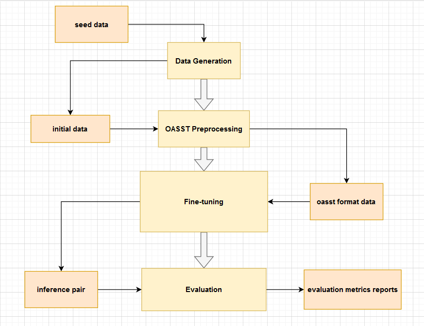

# SYNTOD


## Set up the environment

```
conda create -n syntod python=3.10
conda activate syntod
```

## Framework Structure

In this framework, it is modularized into different steps as the following diagram.



According to the diagram above, the orange squares are refering to data, and the yellow squares are refering to processes, which are corresponding to the folder in the source directory.

For reference, this repository has the following structure :

```
.
└── SynTOD/
    ├── data/
    │   ├── recipe/
    │   │   ├── seed/
    │   │   ├── initial/
    │   │   ├── oasst/
    │   │   └── inference_pair/
    │   ├── ecommerce/
    │   │   ├── seed/
    │   │   ├── initial/
    │   │   ├── oasst/
    │   │   └── inference_pair/
    │   └── README.md
    ├── src/
    │   ├── data-generation/
    │   ├── oasst-preprocess/
    │   ├── fine-tuning/
    │   ├── inference/
    │   └── evaluation/
    ├── reports/
    │   ├── figures/
    │   └── documentation.md
    └── README.md
```

## Run the framework

1. **Data generation**

   [write here]

2. **Preprocessing**

   From the data generation process, we will have the data in the following folder :

   ```
   data/[domain]/initial/
   ```

   More detail regarding the format and the preprocessing, see [here](src/evaluation/README.md)

   To run the preprocessing run the following command : [Add more soon]

   ```
   python oasst-preprocess/[domain]_convert_oasst.py
   ```

3. **Fine-tuning**

   For fine-tuning, we use QLoRA fine-tuning on the LLMs with the preprocessed data. In the `fine-tuning/` folder, there are a script [fine-tune.sh](src/fine-tuning/fine-tune.sh) that you could change the parameter for fine-tuning. For more detail, see [here](src/fine-tuning/README.md)

   To run the script, simply run

   ```
   sh fine-tuning/fine-tune.sh
   ```

4. **Evaluation**

   In the evaluation folder, we have the script used for both evaluation on the validation set and evaluation on the test set, which is `validate.sh` and `evaluate.sh` respectively.

   For example, if you want to run the evaluation script, change the config in the `evaluate.sh` file and then run

   ```
   sh evaluation/evaluate.sh
   ```
